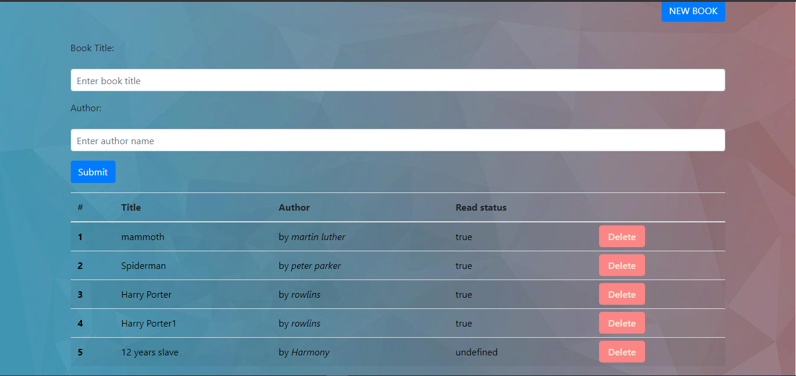

# library-app

> This is a demostration of a library. Users can add their own books and see then on the browser. They can also add/remove the book and lastly change the reading status.

## Screenshot

## FEATURES

- book object that stores data for the Book read or not read by the user.
- books are stored in an array with the name of My Library.
- function called render that generates the HTML for the books in a table looping the array My Library.
- new book button that shows the form that creates the new book the user wants to put in the main table.
- remove button that removes the record from the table.
- Local Storage, so the info persists through the refresh of the page.

## Built With

- HTML 5 and CSS 3.
- Javascript
- Bootstrap

## Live Demo

[Live Demo Link](https://raw.githack.com/hillarioh/The-next-web-clone/tnwBranch/index.html)

## Getting Started

**Just fork it and fell free to use it.**

To get a local copy up and running follow these simple example steps.

### Prerequisites

Having a web browser, code editor and git.

### Install

Just fork it and you are good to go.

## Authors

👤 **Partrick Nyatindo**

- Github: [@nyatindopatrick](https://github.com/nyatindopatrick)
- Twitter: [@nyatindopatrick](https://twitter.com/nyatindopatrick)
- Linkedin: [Patrick nyatindo](https://www.linkedin.com/in/nyatindopatrick/)
- Email: (nyatindopatrick@gmail.com)

👤 **Hillarioh Okerio**

- Github: [@hillarioh](https://github.com/hillarioh)
- Twitter: [@hillaokri](https://twitter.com/hillaokri)
- Linkedin: [Hillarioh Okerio](www.linkedin.com/in/hillaryokerio)
- Email: (okerioh@gmail.com)

## 🤝 Contributing

Contributions, issues and feature requests are welcome!

Feel free to check the [issues page](github.com/hillarioh/The-next-web-clone/issues).

## Show your support

Give a ⭐️ if you like this project!

## Acknowledgments

- Content inspired by the original youtube page.

## 📝 License

This project is [MIT](./LICENSE) licensed.
